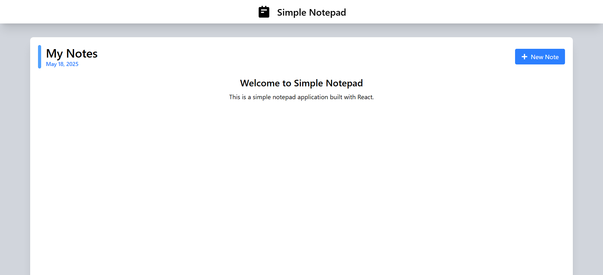
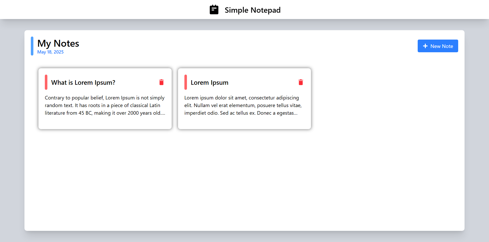
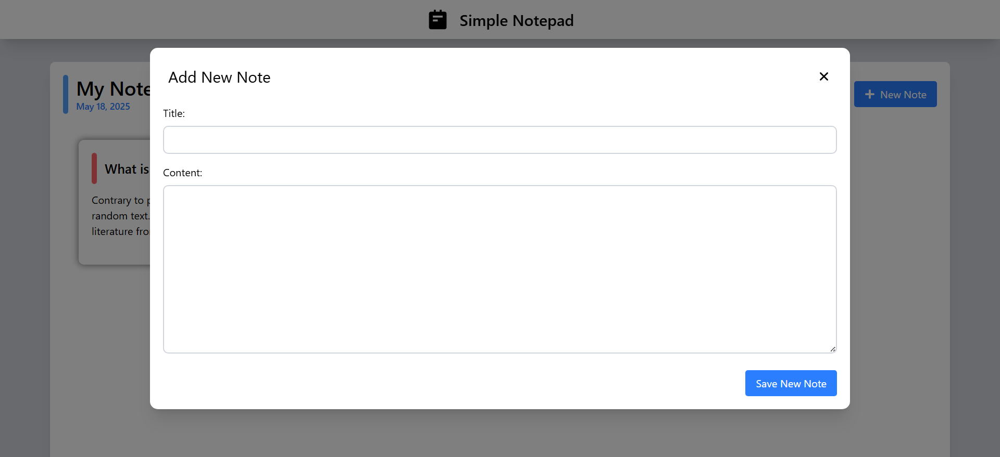
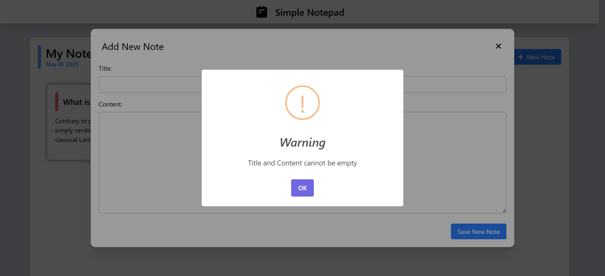
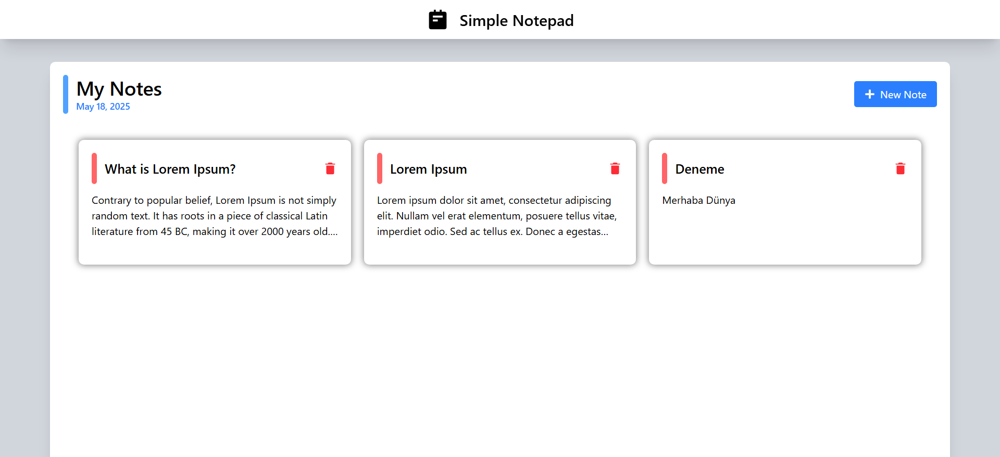
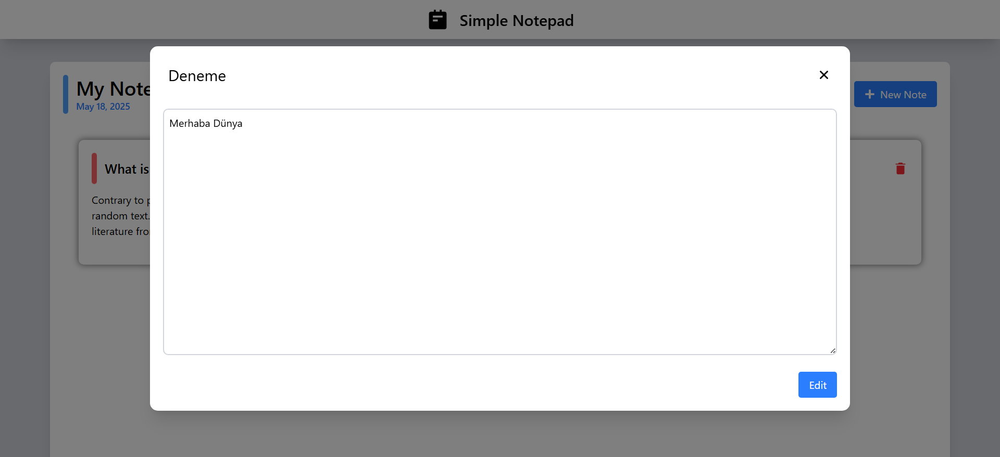
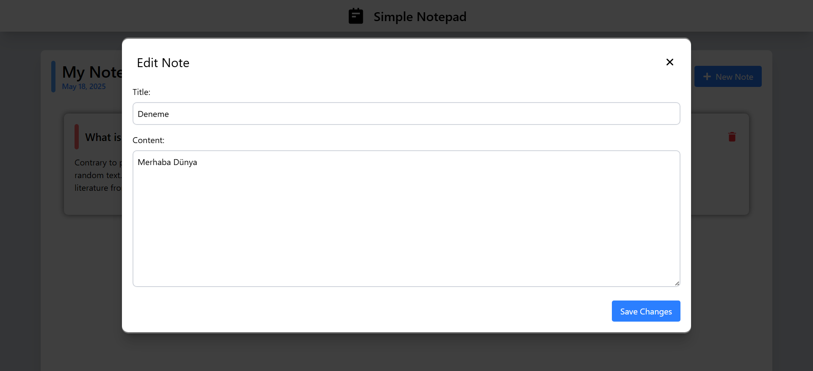
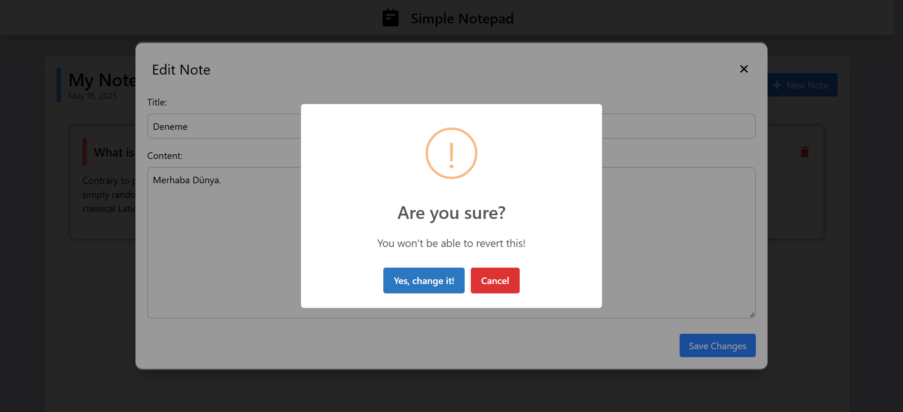
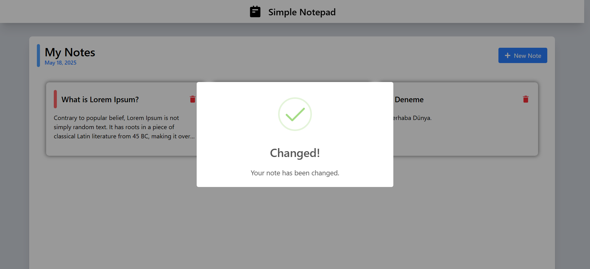
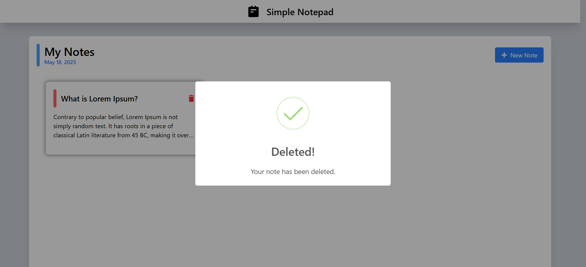

# 📝 Simple Notepad

Bu proje, React ve Tailwind CSS kullanarak geliştirdiğim basit ve kullanıcı dostu bir not defteri uygulamasıdır. Amacım, React'teki temel kavramları pekiştirirken aynı zamanda kullanıcı deneyimini ön planda tutan bir uygulama geliştirmekti.

## 🚀 Proje Özellikleri

- **Not Ekleme:** Kullanıcılar, yeni notlar ekleyebilir.
- **Not Düzenleme:** Mevcut notlar üzerinde düzenlemeler yapılabilir.
- **Not Silme:** İstenmeyen notlar kolayca silinebilir.
- **Veri Kalıcılığı:** Tüm notlar, `localStorage` kullanılarak tarayıcıda saklanır.
- **Özel Modallar:** Not ekleme, düzenleme ve görüntüleme işlemleri için özel modallar kullanılmıştır.
- **Form Doğrulama:** Boş not eklemeye çalışıldığında kullanıcıya uyarı verilir.
- **SweetAlert2 Bildirimleri:** Kullanıcı etkileşimleri için estetik ve bilgilendirici bildirimler kullanılmıştır.:contentReference[oaicite:16]{index=16}

## 🛠️ Kullanılan Teknolojiler

- **React** – UI bileşenlerini oluşturmak için
- **Tailwind CSS** – Hızlı ve modern stil uygulamaları için
- **SweetAlert2** – Bildirim ve onay kutuları için
- **React Icons** – Görevler için ikon desteği

## 📸 Ekran Görüntüleri















## ⚙️ Kurulum ve Çalıştırma

Projeyi kendi bilgisayarınızda çalıştırmak için aşağıdaki adımları izleyin:

```bash
git clone https://github.com/furkan-karapinar/Simple-Notepad-React.git
cd Simple-Notepad-React
npm install
npm run dev

